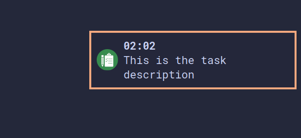

# taskwarrior-hook-notify

Hook of Taskwarrior on start/stop task for run recurring timer of notify.



## Install

```sh
cp ./notify.sh/* $HOME/.config/task
cp on-modify.notify $TASKDATA/hooks
```

See instruction of hooks
<https://taskwarrior.org/docs/hooks/>

## Configuration

- Set recurring period for timer (default 30m)
- Change urgency level for notify (default critical)
- Change image and sound
- Change sound volume level

## Usage

Run `task start` that add notify task for systemd timer.

Run `task stop/done` that delete notification task from timers and read all messages

Custom delete timer of systemd: `systemctl --user stop task-notify.timer`

List all user timers: `systemctl --user list-timers`
